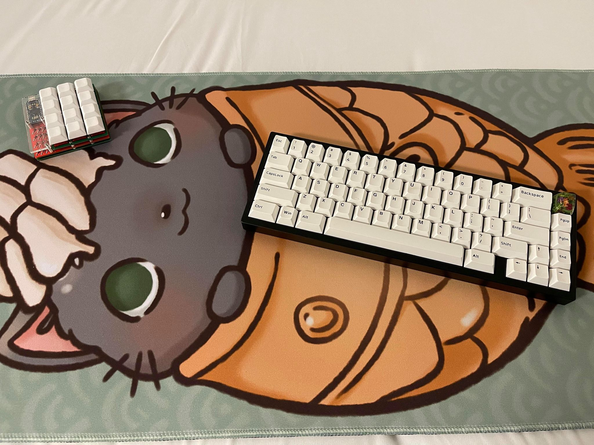

# Hello Hello!

```
System.out.prinln("Welcome to my humble abode!");
cout << "My name is Darian Hong and this is my GitHub Page." << endl;
print "This is sort of a great place to learn more about me!"
```

If you want to hop around a bit:

[To Hobbies](#Hobbies)

[To Goals](#Goals)

# Hobbies

I'm a pretty stereotypical computer science student with hobbies that you could probably guess.

### Gaming

I'm lean in more towards multiplayer games because I can't stand playing video games by myself without friends. So I used to me a huge MMORPG fan, mainly playing _Archeage_ back in those days. Now I play games like _Minecraft_, _League of Legends_, and _Valorant_ with my main group of friends. Usually if you reach out to me in my free time, I'm probably playing games. Some other games that I've played are:
- CSGO
- Rocket League
- Osu!
- Risk of Rain 2
- Rust
- And more!

### Mechanical Keyboards

As expected of a gamer and computer science student, I'm a big fan of mechanical keyboards. But unlike regular sane people, I could be considered a custom mechanical keyboard enthusiast as I invest a significant amount of capital and time into this hobby. I typically spend a lot of time on the computer, like most of you, and I value the experience that my fingers go through and the _music_ that comes from my keyboard. If you'd like to see and learn a bit more about this hobby, then I reccommend you head on over to [the mechanical keyboard Reddit](https://www.reddit.com/r/MechanicalKeyboards/) to see other people's projects and varying levels of "custom"! A forewarning though, this may be a rabbit hole for some of you. Below is an image of what my current keyboard setup looks like. If you would like more information about this, feel free to reach out to me and we can have a nice chat!



### Exercising

I like to believe that I value a healthy body, which is why I enjoy exercising. However, I am a lazy person that also enjoys my other hobbies so sometimes this gets over looked :). I mostly do traditional weightlifting, like what you would normally see in a commercial gym, but I also try to dabble in a bit of calisthenics if I can.

# Goals
Some goals that I have for this quarter are:
- [ ] Survive
- [ ] Bring up my GPA
- [ ] And get the most out of my classes 
- [ ] Perhaps make new friends?

And a final parting word of wisdom to my fellow students:
> Start early, start often - Every CS professor ever
